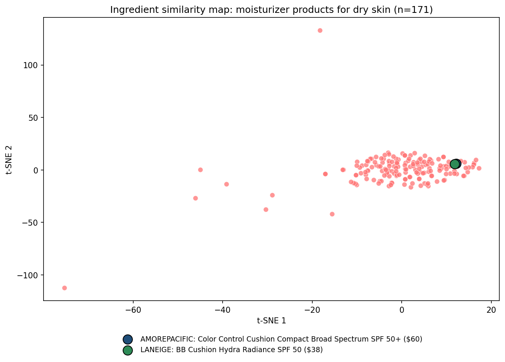

# Analysis of Chemical Components: Cosmetic Recommendation System

A content-based recommendation system that compares skincare products by their **chemical ingredients**, helping people (especially those with sensitive skin) find products with similar formulas without needing a chemistry background.

**Author:** Gracie Bhandari




*Each point is a moisturizer suitable for dry skin. Products that sit close together have similar ingredient lists. The two highlighted products (AmorePacific, $60, and LANEIGE, $38) share 23 ingredients and sit almost on top of each other.*

---

## Problem

Ingredient labels are long, technical and hard to compare. Trying a new product is often a gamble, and the risk is highest for people with sensitive skin. This project turns ingredient lists into data so that products can be compared objectively: if you like one product, you can find others with a similar chemical composition, often at a lower price.

## Approach

| Step | What happens |
|---|---|
| 1. Explore | Load 1,472 Sephora skincare products across 6 categories and 5 skin types. |
| 2. Clean | Remove 171 products without a usable ingredient list (e.g. `No Info`, `Visit the … boutique`, `#NAME?`, footnote-only text). Treat a rating of 0 as "Not rated". |
| 3. Filter | Select one category and one skin type (default: **moisturizers for dry skin**, 171 products). Both are configurable. |
| 4. Tokenize | Split each ingredient list into normalized ingredient names (lower-case, trimmed, footnote markers and retailer disclaimers removed, chemical names such as `1,2-hexanediol` kept intact). |
| 5. Document-term matrix | Build a binary product × ingredient matrix (171 × 1,933). |
| 6. Similarity | Compute pairwise **Jaccard similarity**, the share of ingredients two products have in common. |
| 7. t-SNE | Reduce the matrix to 2D using the Jaccard distances so similar products appear close together. |
| 8. Visualize | Build an interactive **Bokeh** scatter plot with hover details (name, brand, price, rating), plus a static PNG snapshot. |
| 9. Compare & recommend | Quantify the similarity of two products and return ranked alternatives with `recommend(name, top_n, max_price)`. |

## Key results (moisturizers for dry skin)

- **AmorePacific Color Control Cushion Compact SPF 50+ ($60, 4.0★)** and **LANEIGE BB Cushion Hydra Radiance SPF 50 ($38, 4.3★)** share 23 ingredients (Jaccard similarity 0.365, more than 5× the average similarity between products of 0.063). The LANEIGE product is **$22 cheaper and better rated**.
- The recommender ranks the LANEIGE cushion as the closest match to the AmorePacific product, roughly twice as similar as the next-best candidate.
- With a budget filter, the recommender finds ingredient-similar alternatives to the most expensive moisturizer in the selection (Fresh Crème Ancienne, $290) priced at or below the median of $52. The top match is a $50 Caudalie overnight oil.
- Eight products share no ingredients with any other product (mostly single-ingredient oils such as pure argan oil or squalane). They appear as isolated points on the map.

## Repository structure

```
Analysis-of-Chemical-Components/
├── Dataset/
│   └── cosmetics.csv                         # 1,472 products: category, brand, name, price, rating, ingredients, skin-type flags
├── Notebook/
│   └── cosmetic_recommendation_system.ipynb  # Full analysis, executed with outputs
├── Screenshots/
│   ├── tsne_ingredient_map.png               # Static ingredient-similarity map (generated by the notebook)
│   └── project_workflow.png                  # Project workflow diagram
├── Final_Report/
│   └── Final_Report_Gracie_Bhandari.pdf      # Full project report
├── requirements.txt
└── README.md
```

## Dataset

`Dataset/cosmetics.csv` contains Sephora skincare product data obtained from Kaggle.

| Column | Description |
|---|---|
| `Label` | Product category: Moisturizer, Cleanser, Face Mask, Treatment, Eye cream, Sun protect |
| `Brand`, `Name` | Product brand and name |
| `Price` | Price in USD |
| `Rank` | Average customer rating (0–5; 0 means not yet rated) |
| `Ingredients` | Full ingredient list as printed on the product |
| `Combination`, `Dry`, `Normal`, `Oily`, `Sensitive` | `1` if the product is suitable for that skin type, otherwise `0` |

## Getting started

Requires Python 3.9 or later.

```bash
git clone https://github.com/GracieBhandari/Analysis-of-Chemical-Components.git
cd Analysis-of-Chemical-Components

python3 -m venv .venv
source .venv/bin/activate          # Windows: .venv\Scripts\activate
pip install -r requirements.txt

jupyter notebook Notebook/cosmetic_recommendation_system.ipynb
```

Then select **Run → Run All Cells**. The notebook runs in under a minute.

### Exploring other products

In **Section 3** of the notebook, change the two parameters and re-run:

```python
CATEGORY = 'Moisturizer'   # Moisturizer, Cleanser, Face Mask, Treatment, Eye cream, Sun protect
SKIN_TYPE = 'Dry'          # Combination, Dry, Normal, Oily, Sensitive
```

To get recommendations for a specific product in the current selection:

```python
recommend('Crème de la Mer', top_n=5, max_price=60)
```

> **Note:** The Bokeh map is interactive (hover, zoom, pan) when the notebook is run locally. GitHub's notebook preview does not run JavaScript, so it is not shown there. The static snapshot above shows the same map.

## Technologies

Python · pandas · NumPy · SciPy · scikit-learn (t-SNE) · Bokeh · Matplotlib · Jupyter Notebook

## Limitations

- **Ingredient similarity is not skin compatibility.** Concentrations, ingredient order, formulation and individual sensitivities are not modelled, so the results support a purchasing decision but are not dermatological advice.
- Product data (prices, ratings, formulas) reflects Sephora listings at the time the dataset was collected.
- A few listings give only highlighted ingredients rather than the full formula, and a few contain commas inside parentheses, which add minor noise to tokenization.
- t-SNE layouts depend on the random seed and perplexity: distances between nearby points are meaningful, but the global positions of clusters are not.

## Future work

- Weight ingredients by their position on the label (TF-IDF or rank weighting).
- Flag common irritants and allergens for sensitive skin.
- Package the map and recommender as a small web app (e.g. Streamlit or a Bokeh server).

## Project report

The full write-up, covering methodology, implementation, code, results, conclusion and future scope, is in [`Final_Report/Final_Report_Gracie_Bhandari.pdf`](Final_Report/Final_Report_Gracie_Bhandari.pdf).

## Disclaimer

This project was developed as part of the MedTourEasy traineeship program and is shared for academic and portfolio purposes only. It is not affiliated with Sephora or any brand in the dataset.
